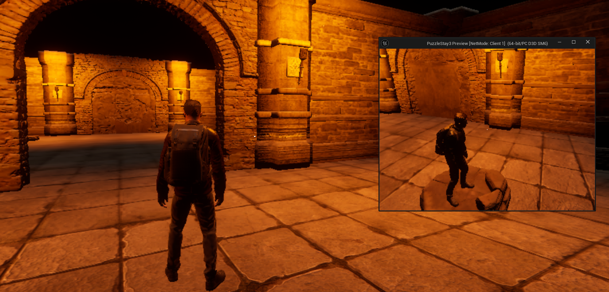
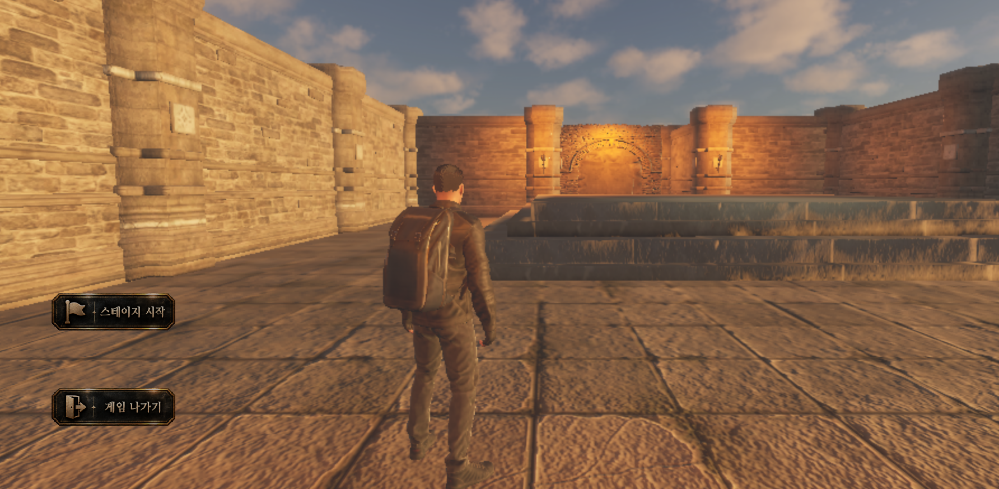

# PuzzleStay3

> 서로 다른 정보를 가진 두 플레이어가 소통하며 고대 유적을 탈출하는 2인 협동 퍼즐 게임

PuzzleStay3는 두 플레이어가 서로의 정보와 행동을 연결해 퍼즐을 해결하는 협동 게임입니다.

스위치의 활성 시간을 맞추고, 자신에게만 보이는 함정을 알려주며, 현장과 관제로 역할을 나누어 총 5개의 스테이지를 진행합니다.

이 저장소는 CH4 팀 프로젝트의 개인 포트폴리오 보관본입니다.
팀 전체 구현과 개인 담당 범위를 구분해 소개합니다.

<!-- 대표 플레이 이미지 추가 -->


## 프로젝트 정보

| 항목 | 내용 |
| --- | --- |
| 장르 | 2인 협동 퍼즐 |
| 플랫폼 | Windows PC |
| 엔진 | Unreal Engine 5.5 |
| 언어 | C++, Blueprint |
| 플레이 인원 | 2명 |
| 스테이지 | 5개 |
| 네트워크 구성 | EOS 로비 및 리슨 서버 |
| 개발 기간 | 2026.08.24 - 2026.09.16|
| 팀 구성 | 6인 |
| 개인 담당 | 황준현 — Player 및 EOS |

- 원본 팀 저장소: [원본 저장소 링크 입력]
- 게임플레이 영상: [영상 링크 입력]
- 발표 자료: [발표 자료 링크 입력]

## 게임의 핵심 경험

### 행동 시간을 맞추는 협동

두 플레이어가 떨어진 위치에서 퍼즐을 함께 조작합니다.
스위치가 모두 활성화되어야 하는 상황에서는 각자의 이동과 상호작용 시간을 조율해야 합니다.

### 서로 다른 정보를 공유하는 협동

같은 공간에서도 플레이어에게 보이는 정보가 다릅니다.
자신에게 보이는 함정이나 경로를 상대에게 전달해야 함께 진행할 수 있습니다.

### 현장과 관제로 나뉘는 협동

현장 플레이어는 직접 이동하고 상호작용합니다.
관제 플레이어는 위에서 경로를 확인하고 문을 조작하며 현장 플레이어를 돕습니다.

두 플레이어는 같은 게임 상태를 공유하지만, 서로 다른 시점과 조작 방식으로 플레이합니다.

## 주요 기능

| 구분 | 구현 내용 |
| --- | --- |
| 협동 퍼즐 | 스위치 활성 조건, 저울 퍼즐 등 스테이지별 기믹 |
| 비대칭 플레이 | 역할에 따른 카메라, 가시성 및 조작 방식 구분 |
| 플레이어 관리 | 입력, 상호작용, 생명·사망 상태, 리스폰 |
| 스테이지 진행 | 성공 조건 확인, 문 개방, 재시작 및 다음 레벨 이동 |
| 온라인 로비 | EOS 로그인, 방 생성·검색·참가·퇴장 |
| 음성 소통 | 로비 음성 채팅과 게임 내 송신 제어 연동 |
| UI | 생명, 제한시간, 상호작용 안내 등 게임 상태 표시 |

## 멀티플레이 구조

**게임 결과는 서버가 확정하고, 각 플레이어의 화면은 그 결과를 반영합니다.**

EOS를 통해 로그인과 로비·음성 기능을 연결하고,
방을 만든 플레이어가 게임 서버 역할도 수행하는 리슨 서버 방식으로 플레이합니다.

### 상호작용 처리 흐름

```text
플레이어 입력
    ↓
소유 캐릭터를 통한 Server RPC 요청
    ↓
서버에서 대상과 실행 조건 확인
    ↓
오브젝트 상태 변경
    ├─ 서버: 퍼즐 및 스테이지 조건 확인
    └─ 클라이언트: 복제된 상태를 바탕으로 화면 갱신
```

상호작용 요청에는 Server RPC를 사용하고,
지속적으로 공유해야 하는 게임 상태는 프로퍼티 복제로 전달합니다.
개별 연출에는 목적에 따라 Client RPC 또는 NetMulticast를 사용합니다.

### 주요 객체의 역할

| 객체 | 역할 |
| --- | --- |
| GameMode | 서버에서 스테이지 규칙과 진행·전환 관리 |
| GameState | 문 개방, 제한시간 등 공유 게임 상태 관리 |
| PlayerState | 생명·사망·역할 등 플레이어별 정보 관리 |
| PlayerController / Character | 입력, 역할별 조작, 서버 요청 전달 |
| Object / Component | 문·스위치·함정 등 월드 기믹 처리 |
| DataAsset | 스테이지 설정과 조정 가능한 값 관리 |
| ViewModel / Widget | 게임 상태를 화면에 필요한 값과 UI로 연결 |

## 공통 구조와 UI 연동

### 공통 기능과 스테이지별 규칙 분리

공통 진행 기능은 Base 클래스에서 관리하고,
각 스테이지는 필요한 동작을 확장하도록 구성했습니다.

설정값은 DataAsset으로 분리하여 코드와 게임 설정의 역할을 구분했습니다.

### 게임 상태와 UI 연결

게임 상태를 표시하는 UI에는 MVVM 구조를 적용했습니다.

```text
GameState / PlayerState의 상태 변경
    ↓
델리게이트 및 UI 서브시스템
    ↓
ViewModel 값 변경과 FieldNotify
    ↓
바인딩된 Widget 갱신
```

게임 로직이 개별 위젯을 직접 제어하는 의존성을 줄이고,
UI에 전달할 값과 화면 표현을 구분했습니다.

## 개인 담당 — 황준현

### Player

- 플레이어 입력과 상호작용 요청 처리
- 소유 캐릭터를 통한 Server RPC 연결
- PlayerState 기반 생명·사망·역할 정보 관리
- 현장·관제 역할별 조작 및 화면 표현 연동
- 리스폰 시 이전 입력 상태 정리
- 입력 초기화 중복 실행 방지와 이벤트·타이머 정리

### EOS 및 음성 연동

- EOS 로그인과 로그인 상태 확인
- 최대 2인 로비 생성·검색·참가·퇴장
- 로비 생성 후 호스트 대기실 실행
- 로비 참가 후 접속 주소 확인 및 호스트 연결
- 비동기 작업 중 중복 요청 제한
- 로비 음성과 게임 내 송신 규칙 연결
- 맵 이동 후 음성 제어 재연결
- 음성 인터페이스 유효성 확인과 구독 해제

> GameMode, 스테이지 기믹, UI 등 전체 시스템 설명에는 팀 공동 구현이 포함됩니다.
> 위 개인 담당 목록과 구분하여 봐주시기 바랍니다.

## 안정성 및 실행 구조 개선

아래는 코드 구조와 수정 이력으로 확인할 수 있는 개선입니다.
별도의 측정 자료가 없는 FPS·메모리·네트워크 성능 향상 수치는 제시하지 않습니다.

| 항목 | 적용 내용 |
| --- | --- |
| 입력 초기화 중복 방지 | 여러 초기화 경로에서 입력 설정이 중복 적용되지 않도록 처리 |
| 온라인 요청 중첩 방지 | 작업 진행 상태를 확인해 비동기 요청 중첩 제한 |
| 음성 이벤트 중복 등록 방지 | 동일한 유효 음성 사용자의 반복 초기화 방지 |
| 연결 유효성 검사 | 현재 EOS 인스턴스와 로그인 사용자, 음성 인터페이스의 일치 여부 확인 |
| 종료 처리 | 객체 종료와 연결 정리 시 관련 타이머 및 이벤트 구독 해제 |
| 재시작 중복 방지 | 사망 이벤트가 연이어 발생할 때 스테이지 재시작 중복 요청 제한 |

## 주요 트러블슈팅

### 1. PIE 월드별 EOS 연결과 중복 초기화

**문제**

여러 PIE 인스턴스에서 현재 월드에 맞는 EOS 연결을 사용하고,
반복 초기화 시 이벤트가 중복 등록되지 않도록 처리해야 했습니다.

**수정**

- 현재 월드를 기준으로 EOS 서브시스템 조회
- 동일 음성 사용자에 대한 초기화 중복 방지
- 연결 변경 시 기존 이벤트 구독 정리

**배운 점**

온라인 기능은 사용자 정보뿐 아니라 연결이 속한 월드와 객체 수명도 함께 고려해야 합니다.

### 2. 클라이언트 음성 수신 문제

**문제**

로비에 참가한 클라이언트에서 상대 음성이 수신되지 않는 문제가 발생했습니다.

**수정**

참가자 추가 이벤트에서 음소거·볼륨 등 수신 설정을 다시 적용하고,
비동기 갱신 시점을 고려해 짧은 지연 후 한 번 더 적용하도록 보완했습니다.

**배운 점**

로비 참가 완료와 실제 음성 수신 준비는 별도로 확인해야 하는 단계입니다.

### 3. 데이터 애셋 초기화 호출 누락 — 팀 사례

**문제**

GameState에서 데이터 애셋을 읽는 초기화 호출이 누락되어,
설정한 UI 표시 시간이 반영되지 않았습니다.

**수정**

BeginPlay에 초기화 호출을 연결하고 관련 초기화 코드를 정리했습니다.

**배운 점**

설정값을 작성하는 것뿐 아니라 런타임에서 언제 읽고 적용하는지도 확인해야 합니다.

## 프로젝트 실행

### 준비 사항

- Unreal Engine 5.5
- 프로젝트를 빌드할 수 있는 C++ 개발 환경
- Git 및 Git LFS
- 온라인 테스트용 EOS 설정과 테스트 계정

프로젝트에서 사용하는 주요 엔진 플러그인:

- OnlineSubsystemEOS
- EOSVoiceChat
- ModelViewViewModel

### 실행 순서

1. 저장소를 클론합니다.
2. 저장소 폴더에서 LFS 파일을 받습니다.

   ```bash
   git lfs install
   git lfs pull
   ```

3. 필요한 외부 에셋과 플러그인을 준비합니다.
4. `PuzzleStay3.uproject`에서 프로젝트 파일을 생성하고 C++ 프로젝트를 빌드합니다.
5. Unreal Editor에서 프로젝트를 엽니다.
6. 온라인 테스트 환경에 맞는 EOS 설정을 적용합니다.
7. 두 플레이어가 로그인한 뒤, 한 명이 로비를 생성하고 다른 한 명이 검색 결과를 선택해 참가합니다.

외부 에셋이 저장소에서 제외되어 있다면 별도로 준비해야 합니다.
필요한 에셋과 설정 방법은 아래 항목에 정리합니다.

- 외부 에셋 및 설치 안내: [목록 또는 문서 링크 입력]
- EOS 설정 안내: [문서 링크 입력]

인증 비밀값은 공개 저장소에 포함하지 않습니다.

## 폴더 구성

```text
PuzzleStay3/
├─ Config/                  # 프로젝트 및 엔진 설정
├─ Content/                 # 맵, Blueprint, UI, 데이터 및 리소스
├─ Source/
│  └─ PuzzleStay3/          # 게임 C++ 코드
├─ Plugins/                 # 프로젝트 플러그인 및 도구
├─ PuzzleStay3.uproject
├─ .gitattributes
└─ .gitignore
```

## 팀 구성

| 이름 | 담당 |
| --- | --- |
| 황준현 | Player, EOS 로비 및 음성 연동 |
| 김현준 | UI, 레벨 디자인 |
| 김명현 | 3d모델링, 게임모드(스테이지5) |
| 김원빈 | 상호작용 오브젝트 |
| 조민웅 | 게임모드(스테이지1~4), 치트 매니저 |
| 양경환 | 기믹, 기믹 베이스 |


## 향후 개선

- 네트워크 지연 환경에서 상호작용과 상태 반영 검증
- 반복 로비 참가·퇴장과 맵 이동 테스트
- 동시 입력·사망·재시작 상황 검증
- 네트워크 트래픽 및 프레임 성능 측정
- 재현 조건과 수정 전후 결과를 포함한 테스트 기록 정리

## 크레딧

본 프로젝트는 팀 공동 작업물입니다.
개인 저장소에서도 원본 프로젝트와 팀원들의 기여를 함께 표기합니다.

외부 에셋과 플러그인의 권리는 각 제작자에게 있으며,
사용 및 재배포에는 해당 리소스의 라이선스가 적용됩니다.